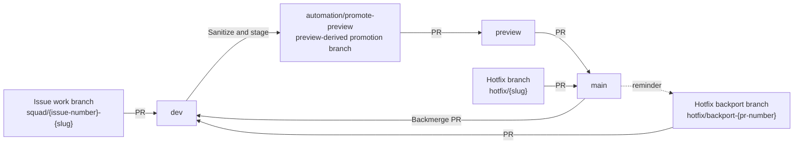
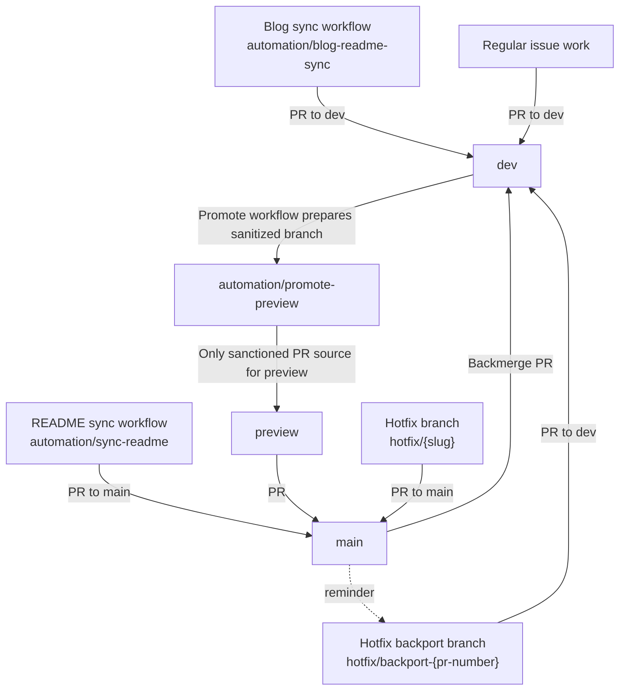

## Purpose

This internal note captures the current branch movement and automation-driven
pull request paths used by the workflow standard as of 2026-07-26.

## Branch Promotion Flow

## Automation PR Flow

## Notes

- Normal delivery starts on a work branch and merges into `dev` by pull
  request.
- Promotion from `dev` to `preview` is workflow-driven through the sanitized
  `automation/promote-preview` branch, then merged by pull request into
  `preview`.
- PRs into `preview` are guarded so the sanctioned promotion branch is the only
  allowed source.
- Promotion from `preview` to `main` happens by pull request.
- PRs into `main` are guarded to allow `preview` for standard releases, with
  `hotfix/*` as the explicit exception path.
- Changes that reach `main` are returned to `dev` through a backmerge pull
  request.
- Blog sync automation targets `dev`, while README sync automation targets
  `main`.
- Hotfixes may go to `main` by pull request, then are backported to `dev` by a
  separate pull request from `hotfix/backport-{pr-number}`.
